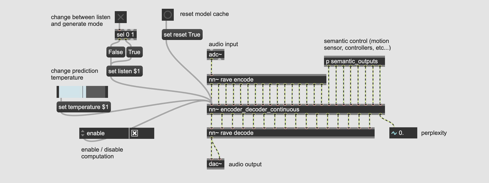

# MSPrior

### A multi(scale/stream) prior model for realtime temporal learning

## Disclaimer

This is an experimental project that *will* be subject to lots of changes.

## Installation

```bash
pip install acids-msprior
```

## Usage

MSPrior assumes you have

1. A pretrained RAVE model exported **without streaming** as a torchscript `.ts` file
2. The dataset on which RAVE has been trained (a folder of audio files).

### 1. Preprocessing

MSPrior operates on the latent representation yielded by RAVE. Therefore, we start by encoding the entirety of the audio dataset into a latent dataset. 

```bash
msprior preprocess --audio /path/to/audio/folder --out_path /path/to/output/folder --rave /path/to/pretrained/rave.ts
```

### 2. Training

MSPrior has several possible configurations. The default is a ALiBi-Transformer with a skip prediction backend, which can run in realtime on powerful computers (e.g. Apple M1-2 chips, GPU enabled Linux stations). A less demanding configuration is a large GRU. Both configurations can launched be using

```bash
msprior train --config configuration  --db_path /path/to/preprocessed/dataset --name training_name --pretrained_embedding /path/to/pretrained/rave.ts
```

Here are the different configurations available


<table>
<thead>
<tr>
<th>Name</th>
<th>Description</th>
</tr>
</thead>
<tbody>

<tr>
<td>decoder_only</td>
<td rowspan=2>Unconditional autoregressive models, relying solely on previous samples to produce a prediction. The recurrent mode uses a Gated Recurrent Unit instead of a Transformer, suitable for small datasets and lower computational requirements.</td>
</tr>

<tr>
<td>recurrent</td>
</tr>

<tr>
<td>encoder_decoder</td>
<td rowspan=2>Encoder / decoder autoregressive mode, where the generation process is conditioned by an external input (aka seq2seq). The continuous version is based on <i>continuous features</i> instead of a discrete token sequence.</td>
</tr>

<tr>
<td>encoder_decoder_continuous</td>
</tr>

</tbody>
</table>

The configurations `decoder_only` and `recurrent` are readily usable, the seq2seq variants depends on another project called `rave2vec` that will be open sourced in the near future.  

### 3. Export

Export your model to a `.ts` file that you can load inside the [nn~ external for Max/MSP and PureData](https://github.com/acids-ircam/nn_tilde).

```bash
msprior export --run /path/to/your/run
```

**WARNING**

If you are training on top of a *continuous* rave (i.e. anything but the `discrete` configuration), you shoud pass the `--continuous` flag during export

```bash
msprior export --run /path/to/your/run --continuous
```

### 4. Realtime usage

Once exported, you can load the model inside MaxMSP following the image below.



Note that additional inputs (e.g. semantic) are only available when using seq2seq models. The last output yields the perplexity of the model.